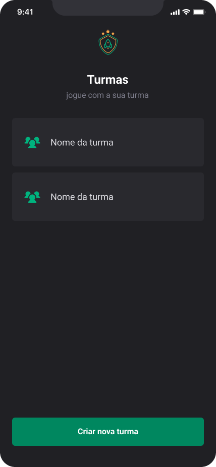
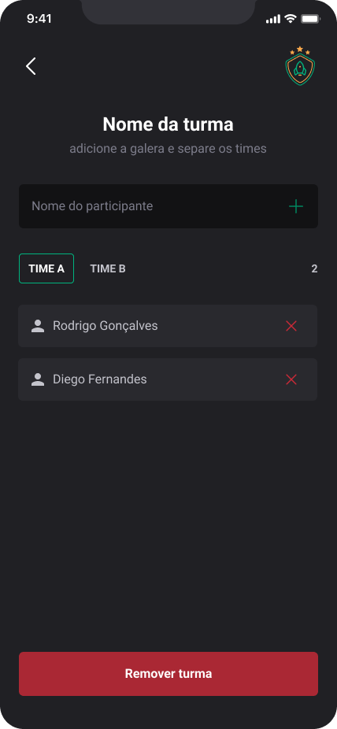

<h1 align="center"> TEAMS ORGANIZER </h1>

<br>

<p align="center">
  
  
  
</p>

## Projeto

Este aplicativo foi criado para ajudar na organização de turmas de pessoas que se reúnem para jogar. Com ele, é possível criar e gerenciar turmas, adicionar ou remover participantes e dividir os grupos em times. As informações ficam armazenadas localmente no dispositivo, garantindo que nada seja perdido, mesmo que o aplicativo seja fechado. Além disso, o app conta com uma navegação em pilhas, para facilitar o uso e tornar a experiência mais agradável.
O objetivo é oferecer uma solução fácil para quem gosta de manter tudo organizado na hora de se divertir com a galera.

## Tecnologias

- React Native
- React
- Typescript
- Expo
- Styled Components
- Async Storage
- React Navigation Stack

## Executando o projeto

Siga os passos abaixo para configurar e executar o aplicativo em seu ambiente local:

### 1. Clone o repositório

No terminal, execute:

```cl
git clone https://github.com/seu-usuario/seu-repositorio.git
cd seu-repositorio
```

### 2. Instale as dependências

Execute o seguinte comando para instalar as bibliotecas necessárias:

```cl
npm install
```

### 3. Execute o aplicativo

Inicie o servidor de desenvolvimento com:

```cl
expo start
```
